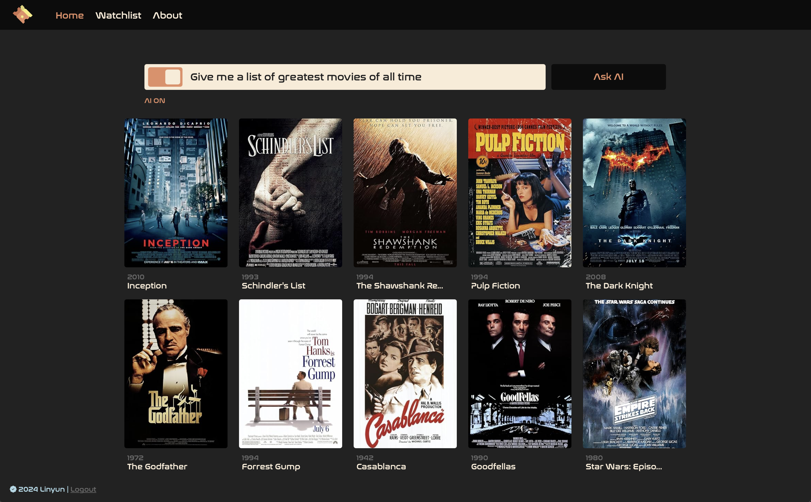

# MovieDataBaseServer (ASP.NET)

### Deployment Instruction (For Ubuntu 22.04)

```bash
sudo apt update && sudo apt upgrade
```

install mysql server ([https://www.digitalocean.com/community/tutorials/how-to-install-mysql-on-ubuntu-22-04](https://www.digitalocean.com/community/tutorials/how-to-install-mysql-on-ubuntu-22-04))


```bash
# Install mysql-server
sudo apt install mysql-server
# Ensure that mysql server is running using the systemctl start command
sudo systemctl start mysql.service
# Enter mysql prompt
sudo mysql
# Then run the following ALTER USER command to change the root user’s authentication method to one that uses a password. 
# The following example changes the authentication method to mysql_native_password:
mysql> ALTER USER 'root'@'localhost' IDENTIFIED WITH mysql_native_password BY 'password';
# After making this change, exit the MySQL prompt
# Then, you can run the mysql_secure_installation script without issue. Otherwise, there will be err
mysql> exit #or mysql> \q

# Run the security script with sudo
# This will prompt you to configure your mysql server
sudo mysql_secure_installation
# !IMPORTANT Type in this password: 'password'
```
Configure mysql server by following the prompts
- Choose Strong Password Validation.
- Remove anonymous users? yes
- Disallow root login remotely? yes
- Remove test database and access to it? yes
- Reload privilege tables now? yes
- Done !
Once the security script completes, you can then reopen MySQL and change the **root** user’s authentication method back to the default, `auth_socket`. To authenticate as the **root** MySQL user using a password, run this command:

```bash
# To authenticate as the root MySQL user using a password, run this command:
mysql -u root -p
# Then go back to using the default authentication method using this command:
mysql> ALTER USER 'root'@'localhost' IDENTIFIED WITH auth_socket;
# This will mean that you can once again connect to MySQL as your root user using the sudo mysql command.
```

Install .NET on Linux
([https://learn.microsoft.com/en-us/dotnet/core/install/linux](https://learn.microsoft.com/en-us/dotnet/core/install/linux))
([https://learn.microsoft.com/en-us/dotnet/core/install/linux-ubuntu-install?tabs=dotnet8&pivots=os-linux-ubuntu-2204](https://learn.microsoft.com/en-us/dotnet/core/install/linux-ubuntu-install?tabs=dotnet8&pivots=os-linux-ubuntu-2204))

```bash
# Install .NET SDK version 8.0
sudo apt-get install -y dotnet-sdk-8.0
# Install ASP.NET Core Runtime
sudo apt-get install -y dotnet-runtime-8.0
```

Transfer the web application to the Server using sftp

```bash
# using git
git clone https://github.com/remote/origin
# using sftp (secure file transfer protocol
# Exit the server and open a terminal on your local machine.
exit
sftp root@xxx.xxx.xxx.xxx
# in the sftp prompt:
sftp> put -r /path/to/your/local/code/folder
# Type exit to exit then ssh back in the server, the folder will be in the home directory
exit
```

Install Dependencies

```bash
dotnet add package DotNetEnv --version 3.1.1
dotnet add package Microsoft.EntityFrameworkCore --version 8.0.0
dotnet add package Microsoft.EntityFrameworkCore.Tools --version 8.0.0
dotnet add package Newtonsoft.Json --version 13.0.3
dotnet add package Pomelo.EntityFrameworkCore.MySql --version 8.0.0

# Check Installed Packages
dotnet list package
```

Modify ConnectionStrings and DataBase Migration

```bash
# Install Migration Tool
dotnet tool install --global dotnet-ef
dotnet tool update --global dotnet-ef

# Add Migration, This will generate the migration files under the Migrations folder in your project.
dotnet ef migrations add InitialCreate

# Make changes to database for real
dotnet ef database update

# At this point mysql server will most likely reject the connection
# Because the app does not have privilege
# Create a new user for the app
mysql> CREATE USER 'movie'@'localhost' IDENTIFIED BY 'NEW PASSWORD';
mysql> GRANT ALL PRIVILEGES ON *.* TO 'movie'@'localhost';
mysql> FLUSH PRIVILEGES;
mysql> exit
sudo service mysql status
systemctl status mysql

# Try Again (Make sure to update connectionStrings in appsettings.json
dotnet ef database update
```

Modify Launch Settings
- Change profiles → http & https applicationUrl
- Replace [localhost](http://localhost) with actual server IP address xxx.xxx.xxx.xxx
- For example "applicationUrl": "[http://xxx.xxx.xxx.xxx:3000](http://xxx.xxx.xxx.xxx:3000/)"
- Check and make necessary IP changes in other static files

Test if the website is working

```bash
dotnet run
```

Use Systemctl to manage the application

```bash
# Create a systemd service file to manage your application. 
# This allows you to start, stop, and restart your application easily.
cd /etc/systemd/system/
# Create a new service file
sudo nano llymovie.service

# Add the following code
[Unit]
Description=ASP.NET Movie DataBase Web Application
After=network.target

[Service]
WorkingDirectory=/root/Movies/MoviesAPI
ExecStart=/usr/bin/dotnet run --urls "http://xxx.xxx.xxx.xxx:3000"
Restart=always
RestartSec=10
SyslogIdentifier=llymovie
User=root
Environment=ASPNETCORE_ENVIRONMENT=Production

[Install]
WantedBy=multi-user.target

#After creating the service file, you can start and enable your application:
sudo systemctl daemon-reload       # Reload systemd to recognize the new service
sudo systemctl start llymovie      # Start the application
sudo systemctl restart llymovie    # Restart the application
sudo systemctl stop llymovie       # Stop the application
sudo systemctl enable llymovie     # Enable it to start on boot
sudo systemctl disable llymovie    # Disable the service from starting on boot

sudo systemctl status llymovie
```

### Setup NGINX for better performance

Resources:
[https://blog.logrocket.com/how-to-run-node-js-server-nginx/](https://blog.logrocket.com/how-to-run-node-js-server-nginx/)
[https://dev.to/jsstackacademy/deploy-nodejs-application-using-nginx-3jhh](https://dev.to/jsstackacademy/deploy-nodejs-application-using-nginx-3jhh)

```bash
# install NGINX
sudo apt install nginx
```

make server.js listen at port 3000

```bash
# Go back few steps to change the server back to listening at localhost
# Assign a port number 3000
# Test application
curl localhost:3000
```

Edit configurations

```bash
# Unlink the default Nginx configuration
sudo unlink /etc/nginx/sites-available/default

# The Nginx configuration is kept in the /etc/nginx/sites-available directory. 
# To create a new configuration, let’s navigate to this directory and create a configuration 
# file pointing to the server block of our Node.js application:
cd /etc/nginx/sites-available
touch server.config
# sudo edit the configuration
sudo vim /etc/nginx/sites-available/server.config
sudo nano /etc/nginx/sites-available/server.config
```

Add the following configuration, change the server_name to the **server IP or the Domain name**

```bash
#The Nginx server instance
server{
    listen 80;
    server_name xxx.com www.xxx.com;
    location / {
        proxy_set_header X-Forwarded-For $proxy_add_x_forwarded_for;
        proxy_set_header Host $host;
        proxy_pass http://127.0.0.1:3000;
        proxy_http_version 1.1;
        proxy_set_header Upgrade $http_upgrade;
        proxy_set_header Connection "upgrade";
        # location /overview {
        #     proxy_pass http://127.0.0.1:3000$request_uri;
        #     proxy_redirect off;
        # }
    }
}

# For the next step, let’s enable the above file by creating a symbolic link from it to the 
# sites-enabled directory, which Nginx reads from during startup:
sudo ln -s /etc/nginx/sites-available/server.config /etc/nginx/sites-enabled/

# The server block is now enabled and configured to return responses to requests based on the listen port and location path.
# Now it’s time to start both our Node.js application and the Nginx service to trigger the recent changes. 
# But first, let’s check the status of Nginx to confirm that the configuration is working properly
sudo nginx -t 
# if successful, we should expect this result:
nginx: the configuration file /etc/nginx/nginx.conf syntax is ok
nginx: configuration file /etc/nginx/nginx.conf test is successful

# if encounter error try look into the default configuration file, if it is empty add the following minimal code
server {
    listen 80 default_server;
    server_name _;
    return 404;
}

# Now restart the NGINX server
sudo systemctl restart nginx

# With Nginx running again, we can allow full access through the Nginx firewall if we want
sudo ufw allow 'Nginx Full'

sudo systemctl restart nginx
# to get status of NGINX
sudo systemctl status nginx
# to stop NGINX
sudo systemctl stop nginx
# to start
sudo systemctl start nginx

# Enable ufw
sudo ufw enable
sudo ufw status
sudo ufw status verbose # more details

```

### Configure SSL (https) with CertBot

Resource:
[https://www.digitalocean.com/community/tutorials/how-to-secure-nginx-with-let-s-encrypt-on-ubuntu-20-04](https://www.digitalocean.com/community/tutorials/how-to-secure-nginx-with-let-s-encrypt-on-ubuntu-20-04)
[https://certbot.eff.org/instructions?ws=nginx&os=ubuntufocal&tab=standard](https://certbot.eff.org/instructions?ws=nginx&os=ubuntufocal&tab=standard)

```bash
# Remove all CertBot package if not the first time installing

# Install CertBot
sudo snap install --classic certbot
# Execute the following instruction on the command line on the machine to ensure that the certbot command can be run.
sudo ln -s /snap/bin/certbot /usr/bin/certbot
# Run this command to get a certificate and have Certbot edit your nginx configuration automatically to serve it, 
# turning on HTTPS access in a single step.
sudo certbot --nginx
# If you're feeling more conservative and would like to make the changes to your nginx configuration by hand, run this command.
sudo certbot certonly --nginx
# Test **automatic renewal**
sudo certbot renew --dry-run
# The command to renew certbot is installed in one of the following locations:
/etc/crontab/
/etc/cron.*/*
systemctl list-timers

# After typed in 'sudo certbot --nginx'
# follow the prompt to setup ssl

# (optional)
sudo ufw allow 80/tcp
sudo ufw allow 443/tcp
# HTTP (port 80) and HTTPS (port 443)
```

### Code Backup

```bash
# ssh in the sever and zip the code folder
zip -r Movies.zip Movies -x '/folder/path/to/ignore/*'
# open another terminal 
sftp> root@xxx.xxx.xxx.xxx
sftp> get Movies.zip

```
